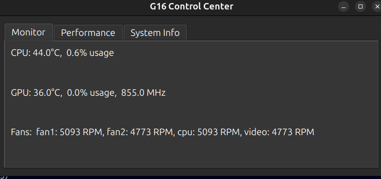
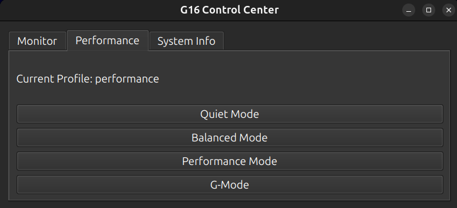

# G16 Control Center

<div align="center">


A lightweight, Linux-friendly control panel for Dell G16 series laptops.

[](https://opensource.org/licenses/MIT)
[](https://www.python.org/downloads/)

</div>

## 📖 Overview

**G16 Control Center** provides essential system control features for Dell G16 laptops running Linux, including performance mode switching, real-time CPU/GPU/fan monitoring, and system information—all without heavy OEM bloat.

**Built with:** Python 3 • PyQt6 • psutil

---

## ✨ Features

### 🚀 Platform Profile Switching
Switch between different performance profiles:
- **Quiet Mode** - Reduced fan noise and power consumption
- **Balanced Mode** - Optimal balance between performance and efficiency
- **Performance Mode** - Enhanced performance for demanding tasks
- **G-Mode** - Maximum performance for gaming and intensive workloads

Uses `pkexec` to apply platform profile settings securely without requiring the UI to run as root.

### 📊 Live Monitoring
Real-time system monitoring updated every second:
- **CPU** - Temperature and usage percentage
- **GPU** - Temperature, usage percentage, and clock speed
- **Fans** - RPM readings for all system fans

### 💻 System Information
View essential hardware details:
- CPU core count and model
- GPU model detection
- RAM capacity
- Kernel version

### 🔔 System Tray Integration
- Persistent tray icon for quick access
- Double-click to open the control center
- Right-click menu with Open/Quit options
- Minimize to tray functionality

---

## � Requirements

### System Dependencies
```bash
sudo apt install python3 python3-pip python3-venv policykit-1
```

### Python Dependencies
- Python 3.8 or higher
- PyQt6
- psutil

---

## 🚀 Installation

### 1. Clone the Repository
```bash
git clone https://github.com/pra-bean/Dell-G16-Control-Center.git
cd Dell-G16-Control-Center
```

### 2. Create a Virtual Environment
```bash
python3 -m venv venv
source venv/bin/activate
```

### 3. Install Python Dependencies
```bash
pip install PyQt6 psutil
```

### 4. Run the Application
```bash
python3 gui.py
```

---

## 🔐 Enabling Performance Mode Switching

To enable profile switching without running the entire application as root:

### Step 1: Create a Polkit Policy File

Create `/usr/share/polkit-1/actions/com.g16control.policy`:

```bash
sudo nano /usr/share/polkit-1/actions/com.g16control.policy
```

Add the following content:

```xml
<?xml version="1.0" encoding="UTF-8"?>
<!DOCTYPE policyconfig PUBLIC
 "-//freedesktop//DTD PolicyKit Policy Configuration 1.0//EN"
 "http://www.freedesktop.org/standards/PolicyKit/1/policyconfig.dtd">
<policyconfig>
  <action id="com.g16control.change-profile">
    <description>Change platform profile</description>
    <message>Authentication is required to change the platform profile</message>
    <defaults>
      <allow_any>auth_admin</allow_any>
      <allow_inactive>auth_admin</allow_inactive>
      <allow_active>auth_admin_keep</allow_active>
    </defaults>
    <annotate key="org.freedesktop.policykit.exec.path">/usr/local/bin/change_profile.py</annotate>
  </action>
</policyconfig>
```

### Step 2: Copy the Helper Script

```bash
sudo cp change_profile.py /usr/local/bin/
sudo chmod +x /usr/local/bin/change_profile.py
```

Now you can switch performance modes without entering your password repeatedly.

---

## 🖥️ Desktop Integration (Optional)

### Install Application Icon
```bash
sudo cp icons/g16control.png /usr/share/icons/hicolor/256x256/apps/g16control.png
sudo gtk-update-icon-cache /usr/share/icons/hicolor/
```

### Create Desktop Launcher

Create `~/.local/share/applications/g16-control-center.desktop`:

```ini
[Desktop Entry]
Name=G16 Control Center
Comment=Performance and monitoring control panel for Dell G16
Exec=/home/YOUR_USERNAME/Dell-G16-Control-Center/venv/bin/python3 /home/YOUR_USERNAME/Dell-G16-Control-Center/gui.py
Icon=g16control
Terminal=false
Type=Application
Categories=Utility;System;Settings;
StartupNotify=true
StartupWMClass=G16Control
Path=/home/YOUR_USERNAME/Dell-G16-Control-Center
```

**Note:** Replace `YOUR_USERNAME` with your actual username.

Make it executable and update the desktop database:
```bash
chmod +x ~/.local/share/applications/g16-control-center.desktop
update-desktop-database ~/.local/share/applications/
```

---

## � Project Structure

```
Dell-G16-Control-Center/
├── gui.py                # Main GUI application
├── cli.py                # Command-line interface
├── monitor.py            # System monitoring (CPU/GPU/Fan)
├── performance.py        # Performance profile management
├── profile_manager.py    # Profile switching logic
├── change_profile.py     # Polkit helper script
├── icons/
│   ├── g16control.png    # Application icon
│   └── tray.png          # System tray icon
├── OpenRGB.AppImage      # OpenRGB integration (optional)
└── README.md
```

---

## 📸 Screenshots

<div align="center">

### Main Interface


### System Monitoring


</div>

---

## 🔒 Security & Permissions

- **Profile switching** requires Polkit authentication (uses `pkexec`)
- **System monitoring** uses standard Linux sensors (read-only access)
- No kernel modules are modified
- Safe for all users - read-only queries except for authenticated profile switching

---

## 🤝 Contributing

Contributions are welcome! Feel free to submit pull requests or open issues.

---

## 📝 License

This project is licensed under the MIT License - see below for details:

```
MIT License

Copyright (c) 2025 Dell G16 Control Center Contributors

Permission is hereby granted, free of charge, to any person obtaining a copy
of this software and associated documentation files (the "Software"), to deal
in the Software without restriction, including without limitation the rights
to use, copy, modify, merge, publish, distribute, sublicense, and/or sell
copies of the Software, and to permit persons to whom the Software is
furnished to do so, subject to the following conditions:

The above copyright notice and this permission notice shall be included in all
copies or substantial portions of the Software.

THE SOFTWARE IS PROVIDED "AS IS", WITHOUT WARRANTY OF ANY KIND, EXPRESS OR
IMPLIED, INCLUDING BUT NOT LIMITED TO THE WARRANTIES OF MERCHANTABILITY,
FITNESS FOR A PARTICULAR PURPOSE AND NONINFRINGEMENT. IN NO EVENT SHALL THE
AUTHORS OR COPYRIGHT HOLDERS BE LIABLE FOR ANY CLAIM, DAMAGES OR OTHER
LIABILITY, WHETHER IN AN ACTION OF CONTRACT, TORT OR OTHERWISE, ARISING FROM,
OUT OF OR IN CONNECTION WITH THE SOFTWARE OR THE USE OR OTHER DEALINGS IN THE
SOFTWARE.
```

---

## 🙏 Acknowledgments

- Built for the Dell G16 Linux community
- Thanks to all contributors and testers

---

<div align="center">

**[⬆ back to top](#g16-control-center)**

Made with ❤️ for Dell G16 users

</div>
